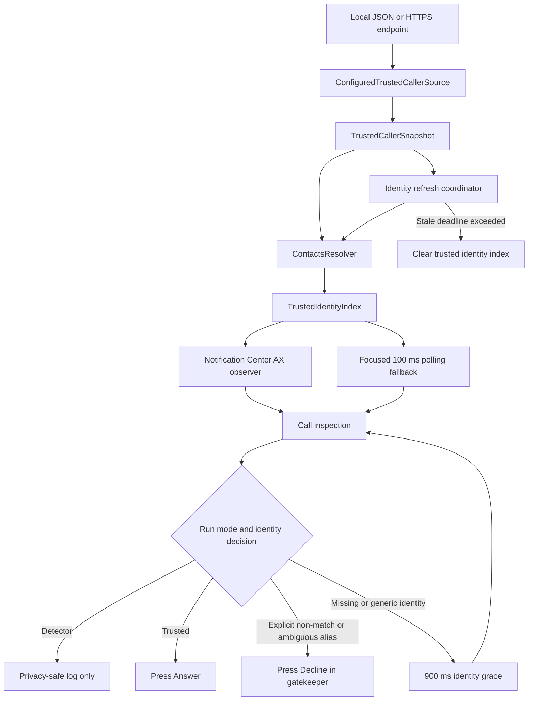

# Architecture

FaceTime Picker is a source-first macOS helper that combines a provider-neutral trusted-caller source with local Contacts resolution and Notification Center Accessibility automation.

## Goals

- Load trusted phone numbers without embedding private data in the repository.
- Support local JSON and arbitrary database-backed HTTPS providers.
- Match the phone number or a unique local Contacts alias shown by FaceTime.
- Keep the incoming-call decision path local and fast.
- Fail closed when identity is missing, ambiguous, stale, or invalid.
- Require an explicit phased rollout before pressing call controls.

## Non-goals

- Direct database connections from the macOS process.
- A FaceTime plugin, extension, or injected component.
- A notarized `.app`, installer, or launch daemon.
- Guaranteed compatibility with future macOS or FaceTime Accessibility hierarchies.
- Recognition of every localized Answer or Decline label.

## Runtime overview

## Startup sequence

1. `FaceTimePickerMain` parses command-line arguments and environment variables.
2. Action modes are rejected unless the launcher supplied `--confirmed-enable`.
3. The process asks macOS to prompt for Accessibility access and immediately checks the current trust result.
4. The configured file or HTTPS source loads and validates the first trusted-caller snapshot.
5. Trusted numbers are resolved against local Contacts on a background queue.
6. FaceTime is opened or activated.
7. The Notification Center process is located.
8. `NotificationCenterMonitor` creates an Accessibility observer, registers relevant notifications, and starts focused polling and heartbeat timers.
9. `IdentityRefreshCoordinator` schedules future allowlist refreshes.
10. The main run loop remains active until the process is stopped.

The first identity load is mandatory. If configuration, Accessibility permission, source loading, Notification Center discovery, or observer creation fails, the process exits before monitoring calls.

## Component map

| File | Responsibility |
|---|---|
| `Sources/AppConfiguration.swift` | Run modes, CLI parsing, stale settings, shared timing and scan limits. |
| `Sources/IdentitySourceConfiguration.swift` | Select exactly one file/URL source and map HTTP headers to environment variables. |
| `Sources/TrustedCallerModels.swift` | JSON models, compatibility field names, snapshots, and identity-source errors. |
| `Sources/TrustedCallerSource.swift` | Read local files, perform HTTPS GET requests, and validate responses. |
| `Sources/ContactsResolver.swift` | Resolve configured numbers to local full names and nicknames while rejecting ambiguous aliases. |
| `Sources/CoreLogic.swift` | Normalize numbers/text, classify caller identity, and make gatekeeper decisions. |
| `Sources/AccessibilitySupport.swift` | Read Accessibility attributes, actions, children, and pressable ancestors. |
| `Sources/CallInspection.swift` | Inspect candidate subtrees and identify caller text, FaceTime markers, and call controls. |
| `Sources/NotificationCenterMonitor.swift` | Own observer state, timers, counters, active-call state, and identity updates. |
| `Sources/NotificationCenterObserver.swift` | Register Accessibility notifications and enqueue inspection signals. |
| `Sources/NotificationCenterPolling.swift` | Poll focused roots as a fallback when notifications are incomplete or late. |
| `Sources/NotificationCenterActions.swift` | Deduplicate calls, apply detector/answer/gatekeeper behavior, and enforce identity grace. |
| `Sources/IdentityRefresh.swift` | Refresh the source, re-resolve Contacts, and clear trust after the stale deadline. |
| `Sources/FaceTimePickerMain.swift` | Wire configuration, source, Contacts resolution, monitor, refresh, and the run loop. |
| `Sources/UnsupportedPlatformMain.swift` | Produce a clear unsupported-platform result when compiled outside macOS. |

## Trusted-caller source

`IdentitySourceConfiguration` requires exactly one of:

- `FACETIME_PICKER_IDENTITY_FILE`
- `FACETIME_PICKER_IDENTITY_URL`

HTTPS configuration may include arbitrary request headers through `FACETIME_PICKER_HEADER_ENVS`. Header values are read from environment variables rather than command-line arguments.

`ConfiguredTrustedCallerSource` performs a synchronous startup load. For HTTPS it sends `GET`, requests JSON, accepts only HTTP `200`, and applies the configured timeout. The response is limited to 256 KB before decoding.

The source returns a `TrustedCallerSnapshot` containing:

- the provider-formatted trusted phone numbers
- an optional provider-suggested refresh interval

See [Identity API](IDENTITY_API.md) for accepted payloads and validation behavior.

## Contacts resolution

The trusted-caller endpoint supplies phone numbers, not names.

`ContactsResolver`:

1. Builds digit variants for every configured number.
2. Requests Contacts access when authorization is undetermined.
3. Enumerates unified contacts off the main thread.
4. Locates contacts containing a trusted phone-number variant.
5. Collects each matching contact's full name and nickname.
6. Counts every local contact that owns each normalized alias.
7. Trusts an alias only when exactly one local contact owns it.
8. Marks aliases owned by multiple contacts as ambiguous.

If Contacts access is denied, restricted, unavailable, or times out, the result retains raw-number matching and disables saved-name trust for that snapshot.

Limited Contacts access is supported, but every trusted contact must be included in the allowed set or saved-name matching fails closed.

## Accessibility monitoring

Incoming FaceTime controls may appear inside the Notification Center process rather than a conventional FaceTime window.

The monitor uses two complementary paths:

### Accessibility notifications

An `AXObserver` listens for window creation, element creation, layout changes, value changes, title changes, and element destruction. Notifications enqueue focused inspections rather than scanning without bounds.

### Focused polling

A 100 ms timer inspects a ranked set of likely roots. Polling provides a fallback when macOS omits, coalesces, or delays useful Accessibility notifications.

Both paths enforce limits on roots, depth, nodes, observer registrations, and scan time. These limits keep a malformed or unexpectedly large Accessibility tree from producing unbounded work.

## Call inspection

A candidate subtree is scored using evidence such as:

- FaceTime marker text
- a call-like container role or subrole
- Answer/Accept control
- Decline/Reject control
- caller text
- a phone-number or Contacts-alias identity result

A strong incoming call requires the expected controls, container signature, and usable caller identity. A separate path tracks a call that has valid FaceTime controls but temporarily lacks usable caller identity.

Internal Accessibility labels, roles, button text, and known Notification Center identifiers are filtered before caller text is considered human identity.

## Decision behavior

### Detector

- Logs candidates and detected calls.
- Never presses Answer or Decline.

### Trusted answer

- Answers a trusted phone number or unique trusted Contacts alias.
- Leaves all other calls ringing.

### Gatekeeper

- Answers a trusted phone number or unique trusted Contacts alias immediately.
- Declines an explicit human-readable non-match immediately.
- Declines an ambiguous Contacts alias immediately.
- Gives missing or generic identity a 900 ms grace period, reinspects the same call surface, and declines only if it remains unverified.

The process also applies a short action cooldown and fingerprints active calls to reduce duplicate presses from repeated Accessibility events.

## Identity refresh

The initial snapshot starts the monitor. Later refreshes run on a utility queue.

On success:

1. The source is loaded and validated.
2. Contacts aliases are resolved again.
3. The monitor replaces its identity index on the main thread.
4. Active and pending-call state is cleared.
5. The stale timer resets.

On failure:

1. The previous valid snapshot remains active.
2. The failure and snapshot age are logged without endpoint or caller details.
3. When the effective stale deadline is reached, the monitor receives an empty identity index.
4. No caller is trusted until a future refresh succeeds.

The effective stale duration is never shorter than the refresh interval. This prevents the identity cache from expiring before the next scheduled refresh attempt.

## Privacy boundaries

Default logs include counts, timing, match source, action result, and a privacy-safe caller state. They do not include raw caller identity unless `--log-caller-text` is explicitly enabled.

The macOS process does not receive database administrator credentials. A provider adapter keeps those credentials server-side and returns only the narrow trusted-caller response.

See [Security model](SECURITY_MODEL.md) for threat assumptions and failure behavior.

## Build model

`build.sh` compiles all `Sources/*.swift` files with Swift 6 and links AppKit, ApplicationServices, and Contacts. It embeds `Resources/Info.plist` into the Mach-O executable and applies an ad-hoc signature.

The output is `build/FaceTimePicker`, not a `.app` bundle. CI can build and test this executable on a macOS runner, but only manual testing can validate a real FaceTime Accessibility hierarchy and button press.
